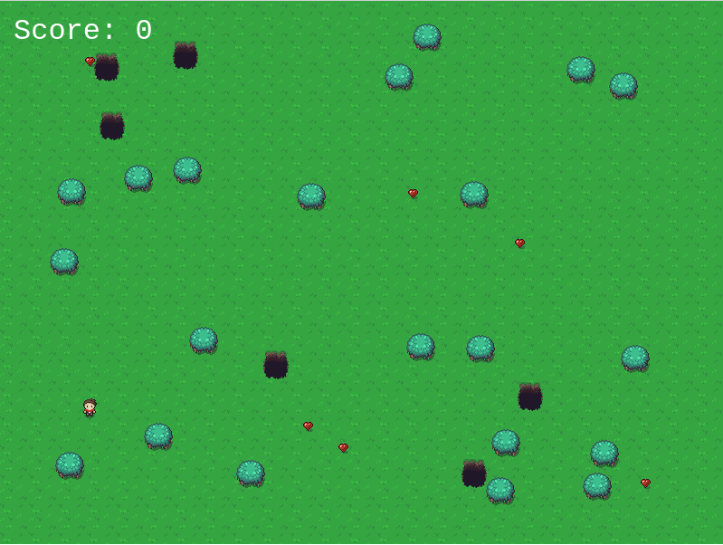

## Building games with Phaser

This is a very small JavaScript game I wrote in about 2 hours to try out [Phaser](https://phaser.io/).
It's a cool game engine to quickly build games.

## The game

In this game, your job is to collect hearts. For each heart you collect, you gain 100 points. But for each heart you collect, a hole appears in the world.
If you fall into a hole, the game ends. 
I said it was simple ;) 

### Controls

You use the 4 arrow keys to move the character around

## Screenshots

The start of the game:

Game over screen:

## Credits

Many thanks to the awesome Zelda like graphics which I used from [here](https://opengameart.org/content/zelda-like-tilesets-and-sprites)
